# Proyecto Final
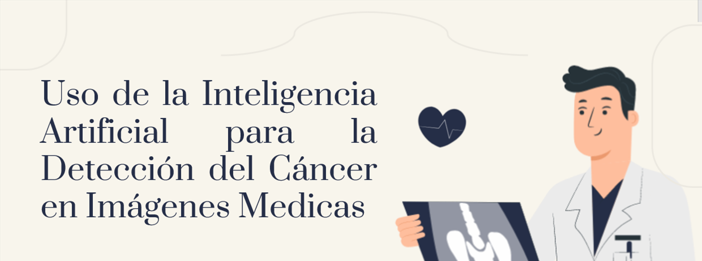
### -Juan Sebastian Garcia Hincapie
### -Juan Pablo contreras Amaya
### -Ricardo Amaya Rivera

## Descripción Básica

El cáncer es una enfermedad crónica que constituye uno de los principales problemas de salud pública; las estadísticas de la Organización Mundial de la Salud (OMS) en el 2012,1 lo ubicaban en el lugar 14 de los problemas de salud causante de 8,2 millones de defunciones por cáncer de hígado, estómago, colon y seno. 

La detección precoz o temprana de cáncer permite diagnosticar en etapas iniciales de la enfermedad aumentando las posibilidades de lograr un tratamiento curativo.

Dentro de la medicina se pueden encontrar tarreas repetitivas o que necesitan una ayuda extra para que los procesos médicos sean lo más óptimos y veraces posibles

Este proyecto tiene como finalidad la creación de un software con inteligencia artificial capaz de reconocer y detectar a partir de imágenes diagnósticas y sintomatologías la aparición y evolución de tumores malignos o cancerígenos, dando como resultado una aproximación a un diagnóstico médico y acelerando así la pronta detección y tratamiento oportuno de estos mismos.

## Machine Learning

El Machine Learning es una disciplina del campo de la Inteligencia Artificial que, a través de algoritmos, dota a los ordenadores de la capacidad de identificar patrones en datos masivos y elaborar predicciones (análisis predictivo).

## Deep Learning

Es un subconjunto de machine learning (que a su vez es parte de la inteligencia artificial) donde las redes neuronales, algoritmos inspirados en cómo funciona el cerebro humano, aprenden de grandes cantidades de datos.

## Estructura en AWS

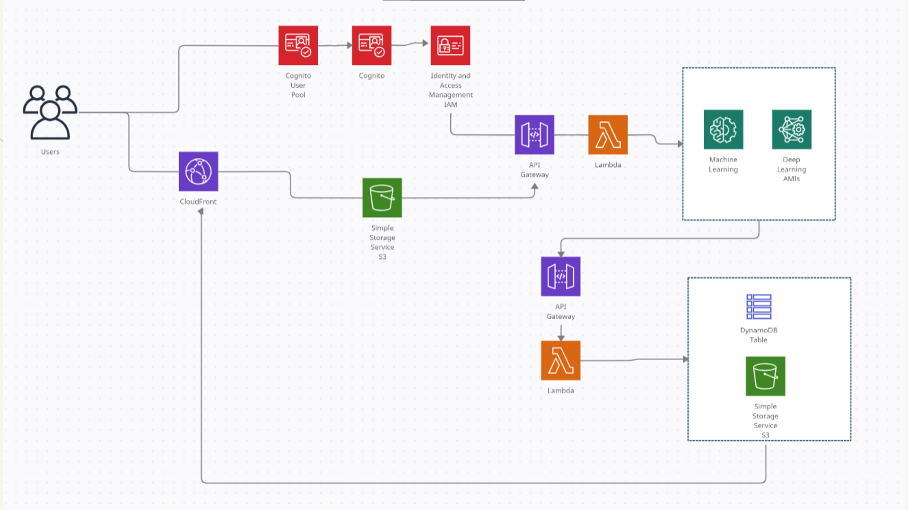

## Implementación practica
### Parte 1 java

Como primer parte practica se implementó un comparador de imagenes en java que muestra el porcentaje de similitud de una imagne con otra, esta idea no hace uso de ninguna inteligencia artificial pero busca recrear la idea central del proyecto.

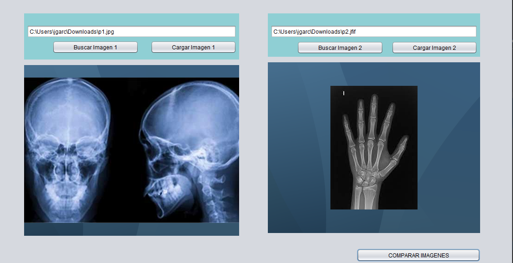

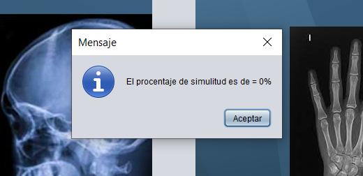

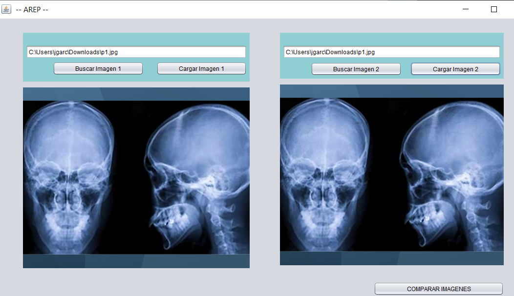

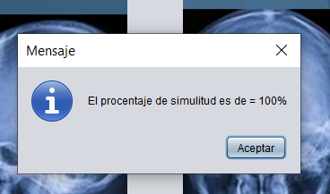

### Parte 2 Aws rekognition 

Amazon Rekognition es una herramienta que facilita la incorporación de análisis de imágenes y vídeo a sus aplicaciones. el servicio puede identificar objetos, personas, texto, escenas y actividades. Asimismo, puede detectar cualquier contenido inadecuado.

### Uso de la herramienta:
### Ejemplo 1
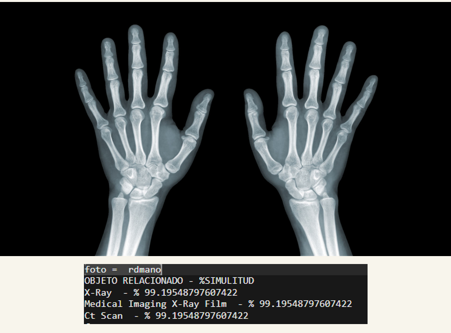
### Ejemplo 2
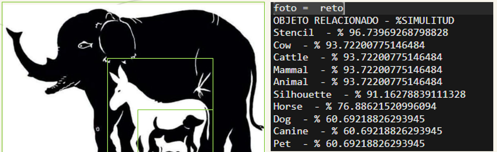
### Ejemplo 3
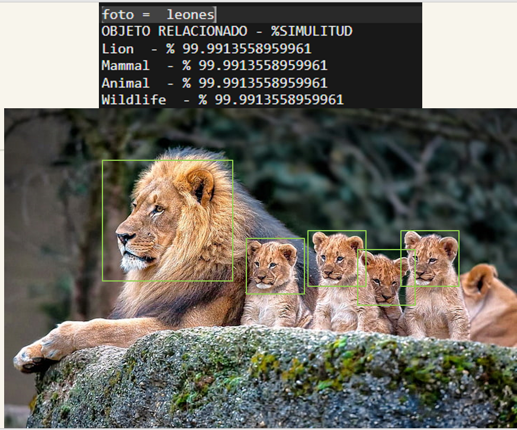
### Ejemplo 4
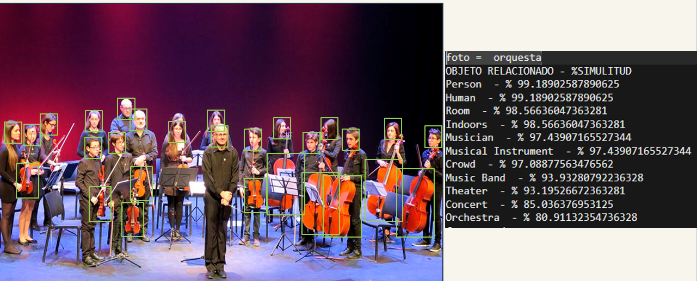
### Ejemplo 5
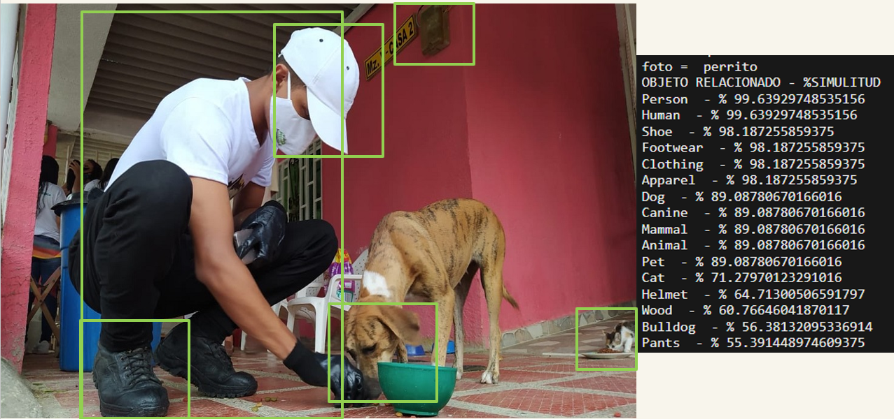

## Construido con: 
* [Java] (https://www.oracle.com/technetwork/java/javase/downloads/jdk8-downloads-2133151.html)
* [Maven] (https://maven.apache.org/)
* [AWS] (https://aws.amazon.com/es/)

# Licencia & Derechos de Autor

**©** Juan Sebastian Garcia Hincapie , Juan Pablo Contreras , Ricardo Amaya Rivera. [Escuela Colombiana de Ingeniería Julio Garavito](https://www.escuelaing.edu.co/es/)  
Licencia bajo la [GNU General Public License](/LICENSE).

